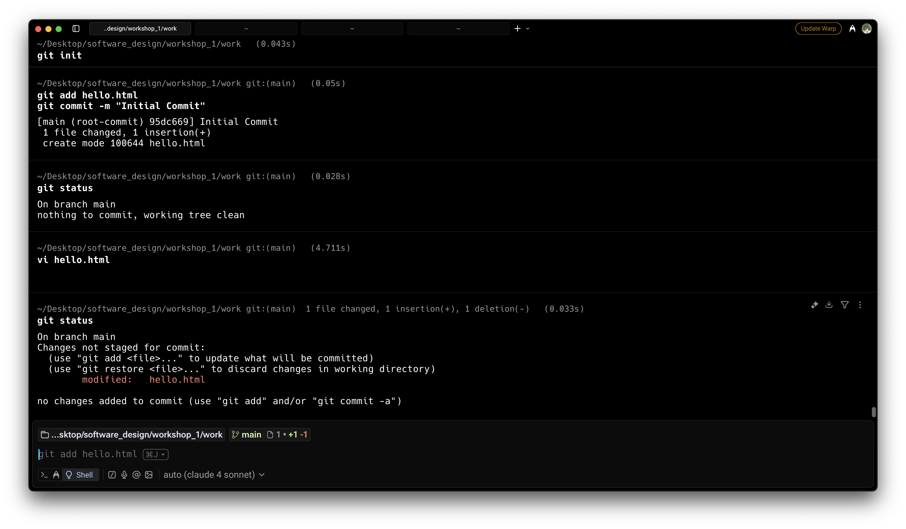
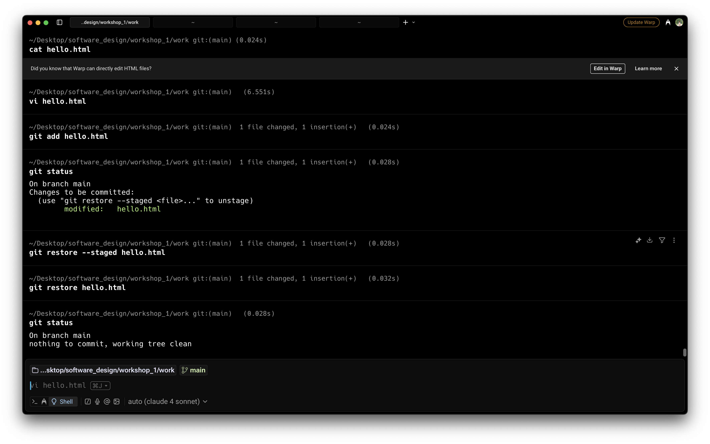
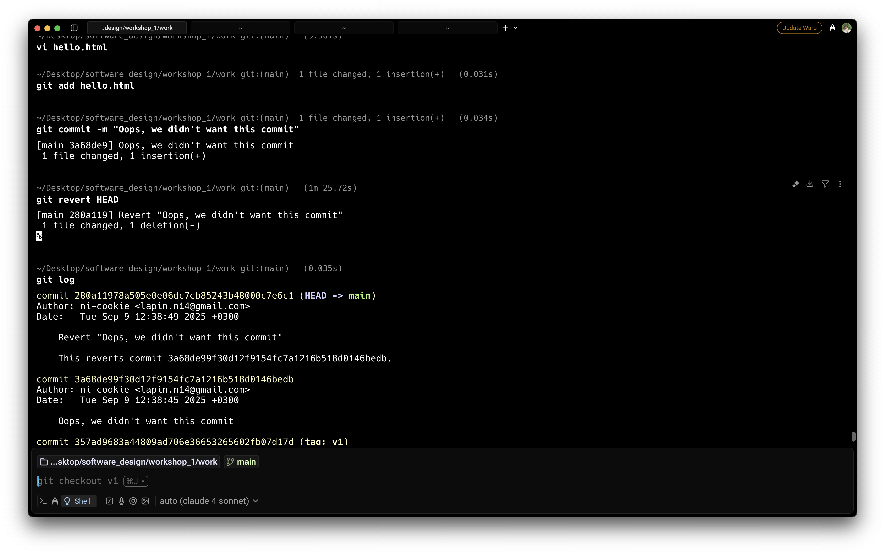

# Звіт по практичній роботі №1

## Мета роботи

Ознайомитися з базовими командами та принципами роботи з системою контролю версій Git шляхом проходження інтерактивного навчального курсу. Сформувати практичні навички використання Git у консольному середовищі для виконання основних операцій.

## Завдання

Пройти інтерактивний курс «Git How To» за посиланням: [https://githowto.com/uk](https://githowto.com/uk).

### Мінімальні вимоги (обов’язкова частина):
- Повністю пройти Частину 1 курсу, яка охоплює базові операції:
  - Ініціалізація репозиторію;
  - Додавання та коміти файлів;
  - Перегляд історії;
  - Скасування змін;
  - Робота з гілками.

## Виконання

### Частина 1: Основи роботи з Git
Я пройшов першу частину курсу, яка включала основні операції роботи з Git. У процесі виконання я виконав наступні кроки:

1. **Ініціалізація репозиторію**  
   Створив новий Git-репозиторій, використовуючи команду `git init`.
   
2. **Додавання та коміти файлів**  
   Додав файли до репозиторію за допомогою команди `git add .` та зробив перший коміт через `git commit -m "Initial commit"`.

3. **Перегляд історії**  
   Переглянув історію комітів за допомогою команди `git log`.

4. **Скасування змін**  
   Використав команди для скасування змін: 
   - `git restore` для скасування незаписаних змін;
   - `git reset` для скасування проіндексованих змін.

5. **Робота з гілками**  
   Створив нову гілку за допомогою `git branch` та переключився на неї через `git checkout`.

### Скриншоти
Всі кроки були зафіксовані за допомогою скріншотів, які знаходяться в папці `screenshots/`. Нижче наведено список файлів з підтвердженням виконаних етапів:

1. 
2. 
3. 
4. 
5. 
6. 
7. 
8. 
9. 
10. 
11. 
12. 
13. 
14. 
15. 
16. 
17. 
18. 
19. 
20. 
21. 
22. 
23. 
24. 
25. 
26. 
27. 
28. 
29. 
30. 
31. 
32. 
33. 
34. 
35. 

## Висновки

Після виконання завдання я здобув важливі навички роботи з Git:
- Виконання базових операцій: ініціалізація репозиторію, додавання та коміти файлів, перегляд історії.
- Розуміння основних принципів версійного контролю та роботи з гілками.
- Оволодів практичними навичками скасування змін та маніпулювання історією комітів.

Завдяки інтерактивному курсу я зміг не лише освоїти теоретичні основи Git, але й застосувати їх на практиці, що значно покращило розуміння роботи з цією системою.

## Додаткові зауваження

Практичне заняття було корисним для закріплення базових знань щодо Git.
